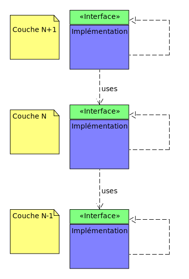
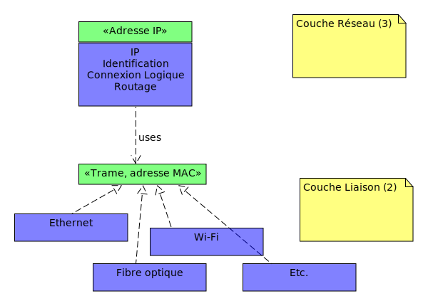
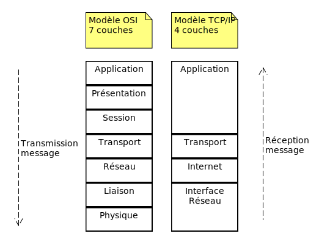

# Architecture d'Internet (et du web) - Glossaire

- [Architecture d'Internet (et du web) - Glossaire](#architecture-dinternet-et-du-web---glossaire)
  - [Modèle OSI](#modèle-osi)
  - [Modèle TCP/IP](#modèle-tcpip)
  - [Service Data Unit (SDU)](#service-data-unit-sdu)
  - [Protocol Data Unit (PDU)](#protocol-data-unit-pdu)
  - [Domain Name Service (DNS)](#domain-name-service-dns)
  - [Autonomous System (AS)](#autonomous-system-as)
  - [Paquet (IP)](#paquet-ip)
  - [Trame (Ethernet)](#trame-ethernet)
  - [Frame Check Sequence (FCS)](#frame-check-sequence-fcs)
  - [Adresse MAC (*Media Access Control*)](#adresse-mac-media-access-control)
  - [ARP (Address Resolution Protocol)](#arp-address-resolution-protocol)
  - [IP (Internet Protocol)](#ip-internet-protocol)
  - [ICMP (Internet Control Message Protocol)](#icmp-internet-control-message-protocol)
  - [TCP (Transmission Control Protocol)](#tcp-transmission-control-protocol)
  - [UDP (User Datagram Protocol)](#udp-user-datagram-protocol)
  - [Border Gateway Protocol (BGP)](#border-gateway-protocol-bgp)
  - [HTTP (HyperText Transfert Protocol)](#http-hypertext-transfert-protocol)
  - [FTP (File Transfert Protocol)](#ftp-file-transfert-protocol)
  - [FTPS (File Transfer Protocol Secure)](#ftps-file-transfer-protocol-secure)
  - [SSH (Secure Shell)](#ssh-secure-shell)
  - [SFTP (SSH File Transfer Protocol )](#sftp-ssh-file-transfer-protocol-)
  - [SMTP (Simple Mail Transfer Protocol)](#smtp-simple-mail-transfer-protocol)

## Modèle OSI

Le [modèle *Open Systems Interconnection* (OSI)](https://fr.wikipedia.org/wiki/Mod%C3%A8le_OSI) est une façon *standardisée* de segmenter en plusieurs *couches* le processus de communication entre deux entités. 

Une *couche* est un *ensemble de services* accomplissant un but précis. Chaque couche du modèle OSI communique avec les couches au-dessus et au-dessous d'elle. La couche en-dessous fournit des services que la couche en cours utilise et cette dernière pourvoit des services dont la couche au-dessus d'elle aura besoin pour assurer son rôle.

Chaque couche *expose une interface à la couche supérieure* et dispose de son implémentation.

Ainsi, l'*implémentation* de chaque couche peut changer, évoluer, être remplacée sans impacter les autres. Par exemple, cela explique pourquoi nous avons pu passer de l'Internet filaire au Wi-Fi sans avoir à réécrire le protocole HTTP : seule l'implémentation des couches basses a changé, tandis que les couches supérieures sont restées identiques. C'est un cas classique d'application des principes d'*encapsulation*, de [*polymorphisme*](https://en.wikipedia.org/wiki/Polymorphism_(computer_science)) et de la [Separation of Concerns (SoC)*](https://en.wikipedia.org/wiki/Separation_of_concerns).

Grâce à ces principes, chaque couche n'a besoin de connaître que l'*interface* de la couche inférieure, sans se soucier de ses détails d'implémentation (*abstraction*) et de fournir une interface à la couche supérieure. En masquant la complexité des couches inférieures, le modèle OSI permet au développeur·se web de se concentrer sur la logique métier et la formation correcte de ses messages HTTP, avec la certitude que les octets arriveront à destination, sans avoir à se soucier de *comment* ces octets sont transmis sur le réseau.

> Par exemple, pour la couche *Réseau* (IP), la couche *Liaison de données* est une abstraction, une *trame*, qui peut prendre la "forme" d'Ethernet, de Wi-Fi, de 4G/5G, etc.

Le modèle OSI segmente le processus de communications en *sept* couches :

- **Application** : Point de contact des applications avec les services réseaux (envoi d'une requête HTTP, d'un email via SMTP, d'un fichier via FTP, etc.)
- **Présentation** : S'occupe de tout aspect lié à la présentation des données : *format*, *chiffrement*, *encodage*, etc.
- **Session** : Responsable de la session, de sa gestion et de sa fermeture
- **Transport** : Choix du *protocole de transmission*. Spécifie les *ports* de l'application émettrice et réceptrice. Fragmente le message en *segments*
- **Réseau** : Connexion logique entre les machines. Traite l'*identification* et le *routage* des *paquets* dans le réseau.
- **Liaison** (de données) : Établissement d'une liaison physique entre les machines avec leur *adresse MAC*. Fragmente les messages en *trames*
- **Physique** : Convertit les trames en bits et transmission physique du message sur le média (encodage par signal électrique, lumineux, ondes électromagnétiques, etc.)

> Un moyen mnémotechnique pour s'en souvenir "**P**artout **L**e **R**oi **T**rouve **S**a **P**lace **A**ssise"

Quand une machine A envoie un message à une machine B, le processus d'envoi va de la couche 7 (application) à la couche 1 (physique). A la réception, le message emprunte le chemin inverse : il part de la couche 1 pour arriver à la couche 7. 

A l'émission, le message passe à travers chaque couche. Chaque couche enveloppe le message reçu par la couche supérieure ([SDU](#service-data-unit-sdu)). C'est le principe d'*encapsulation* (comme des poupées russes).

> Chaque couche ajoute ses propres header et donc des octets (*overhead*). Cela explique pourquoi un petit message de 10 octets en HTTP finit par peser beaucoup plus sur le câble : il faut compter l'en-tête HTTP + l'en-tête TCP + l'en-tête IP + l'en-tête/footer Ethernet.

## Modèle TCP/IP

[Le modèle OSI](#modèle-osi) a été crée en 1978 par l'Organisation Internationale de Standardisation (ISO). Il a une vocation *normative* et ne reflète pas *exactement* l'implémentation du processus de communication en pratique. Il sert de référence. 

Le modèle TCP/IP est un modèle descriptif qui explique *comment* la communication se déroule réellement. Il n'est composé que de quatre couches : Application, Transport, Internet et Interface Réseau.

## Service Data Unit (SDU)

[Service Data Unit (SDU)](https://fr.wikipedia.org/wiki/Service_Data_Unit) est la *donnée* que la couche C+1 transmet à la couche C (inférieure), avant qu'elle ne l'encapsule. Le SDU est le *payload*, la charge utile qui arrive à chaque couche. Autrement dit, c'est l'*input* de la couche C.

## Protocol Data Unit (PDU)

Protocol Data Unit (PDU). Dans une couche C, le PDU est le [SDU](#service-data-unit-sdu) de la couche C+1 plus son en-tête (de la couche C). La couche C ajoute ses informations au SDU de la couche C+1 sous la forme de header/footer.

$PDU_C​=Header_C+SDU_{C}$

Autrement dit, c'est l'*output* de la couche C.

A l'émission, chaque couche encapsule le SDU de la couche précédente en ajoutant ses en-têtes. Une fois arrivée à la couche Liaison l'encapsulation du message est terminé. A la réception, chaque couche récupère l'en-tête qui lui est destiné et le supprime.

> La couche Liaison est la seule qui ajoute souvent un *Footer* en plus du Header, notamment pour le *Frame Check Sequence (FCS)* qui sert à vérifier que les données n'ont pas été corrompues pendant le transport physique.

| Couche       | Unité de donnée encapsulée (PDU)         |
| ------------ | ---------------------------------------- |
| Application  | APDU (Ex: Message + headers HTTP)        |
| Présentation | PPDU                                     |
| Session      | SPDU                                     |
| Transport    | TPDU (Segment (TCP) ou Datagramme (UDP)) |
| Réseau       | Paquet                                   |
| Liaison      | Trame   (Ethernet, Wi-fi, etc.)          |
| Physique     | Bit                                      |

## Domain Name Service (DNS)

Un service informatique *distribué* dont la fonction principale est de maintenir et de fournir les associations entre les *noms de domaine* Internet avec *leurs [adresses IP](#ip-internet-protocol)*.

## Autonomous System (AS)

Un ensemble de réseaux informatiques IP intégrés à Internet et dont la politique de routage interne (routes à choisir en priorité, filtrage des annonces) est cohérente. Un AS est généralement sous le contrôle d'une entité ou organisation unique, typiquement un fournisseur d'accès à Internet. [Environ 120 000 en 2026](https://www-public.telecom-sudparis.eu/~maigron/rir-stats/rir-delegations/world/world-asn-by-number.html).

## Paquet (IP)

Un paquet (*packet*) est le [PDU](#protocol-data-unit-pdu) de la couche Réseau (couche 3). Il encapsule le segment (TPDU) provenant de la couche Transport.

## Trame (Ethernet)

Une *trame* (*frame*) est le [PDU](#service-data-unit-sdu) de la couche Liaison (couche 2). Son [SDU](#service-data-unit-sdu) est le [paquet IP](#service-data-unit-sdu).

La trame est la structure qui encapsule les données juste avant qu'elles ne soient transformées en signaux électriques ou lumineux (bits). Elle utilise les [adresses MAC (Media Access Control)](#adresse-mac-media-access-control) pour identifier l'expéditeur et le destinataire au sein d'un réseau local (LAN). Elle inclut au SDU :

- Header : Adresses MAC Destinataire et Source : L'identité physique des machines ;
- Footer : un mécanisme de détection d'erreurs (le [FCS](#frame-check-sequence-fcs)) pour s'assurer que les données n'ont pas été altérées pendant le transport physique.

Une trame (Ethernet) est un message écrit en binaire. 

> Afin de limiter la taille de l'affichage, on choisit parfois de grouper ces bits en octets et de les représenter sous forme hexadécimale. 

## Frame Check Sequence (FCS)

## Adresse MAC (*Media Access Control*)

Une adresse MAC (*Media Access Control*), parfois nommée *adresse physique*, est un identifiant physique stocké dans une carte réseau ou une interface réseau similaire. Chaque adresse MAC est unique au monde. Toutes les cartes réseau ont une adresse MAC, même celles contenues dans les PC et autres appareils connectés (tablette tactile, smartphone, consoles de jeux, réfrigérateurs, montres, etc.).

## ARP (Address Resolution Protocol)

L'Address Resolution Protocol (ARP, protocole de résolution d’adresse) est un protocole utilisé pour *associer l'adresse de protocole de couche réseau* (typiquement une adresse IPv4) d'un hôte distant, *à son adresse de protocole de couche de liaison* (typiquement une adresse MAC). 

> Il se situe à l’interface entre la couche réseau (couche 3 du modèle OSI) et la couche de liaison (couche 2 du modèle OSI).

La couche réseau construit une voie de communication de *bout à bout* à partir de voies de communication avec ses voisins directs. Ses apports fonctionnels principaux sont 1) le routage (trouver un chemin reliant 2 machines) 2) relayage/retransmission des données.

## IP (Internet Protocol)

Une famille de protocoles de communication de réseaux informatiques permettent un service d'adressage unique pour l'ensemble des terminaux connectés. 

> Couche Réseau (Couche 3 du modèle OSI)

## ICMP (Internet Control Message Protocol)

Le [protocole IP](#ip-internet-protocol) ne gérant que le transport des paquets et ne permettant pas l'envoi de messages d'erreur, on lui associe ICMP pour contrôler les erreurs de transmission. ICMP permet de transporter des messages de contrôle et d’erreur pour qu'une machine émettrice sache qu'il y a eu un incident de réseau, par exemple lorsqu’un service ou un hôte est inaccessible. La commande Ping est un exemple d'application utilisant des messages de contrôle ICMP.

> Couche Réseau (Couche 3 du modèle OSI)

## TCP (Transmission Control Protocol)

TCP est un protocole de transport fiable, en mode connecté, basé sur un *stream* (flux) d'octets découpé en *segments*.

> Couche Transport (Couche 4 du modèle OSI)

## UDP (User Datagram Protocol)

UDP permet la transmission de données (sous forme de [datagrammes](https://fr.wikipedia.org/wiki/Datagramme)) de manière très simple entre deux entités, chacune étant définie par une adresse IP et un numéro de port. Aucune communication préalable n'est requise pour établir la connexion, au contraire de TCP (qui utilise le procédé de *handshaking*). UDP utilise un mode de transmission *sans connexion*. 

> Couche Transport (Couche 4 du modèle OSI)

## Border Gateway Protocol (BGP)

Protocole d'échange de route externe. Permet aux routeurs de s'échanger les "meilleurs" path (adresses IP) pour passer d'[un AS](#autonomous-system-as) à l'autre : chemin le plus stable et conforme à des accords commerciaux, souveraineté des états, etc. (pas le chemin le plus cours). Ce protocole dote les routeurs d'une table de routage. 

> Couche Application (Couche 7 du modèle OSI)

## HTTP (HyperText Transfert Protocol)

> Couche Application (Couche 7 du modèle OSI)

## FTP (File Transfert Protocol)

> Couche Application (Couche 7 du modèle OSI)

## FTPS (File Transfer Protocol Secure)

> Couche Application (Couche 7 du modèle OSI)

## SSH (Secure Shell)

> Couche Application (Couche 7 du modèle OSI)

## SFTP (SSH File Transfer Protocol )

> Couche Application (Couche 7 du modèle OSI)

## SMTP (Simple Mail Transfer Protocol)

> Couche Application (Couche 7 du modèle OSI)
